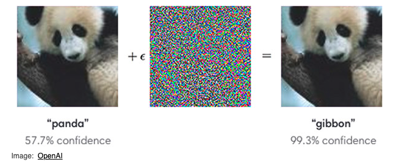

# Adversarial-Attacks-and-Defenses

Adversarial attacks pose a serious threat to machine learning models as they are a perturbation that is added to an image that causes it to appear unaltered to the human eye but be misclassified as something else by a regular classifier. These attacks can be used for exploitation purposes. An example is street stealthware where glasses or clothing with adversarial patterns can deceive facial recognition models.

Here is an example of an adversarial input that was added to an image of a panda that had a confidence of 57.7% before. After attacking the image, the classifier was 99.3% confident that it was an image of a gibbon.

In this project, I worked primarily on the MNIST dataset with the following attacks from Cleverhans library and defenses respectively.

| Attacks | Defences |
| --- | --- |
| Fast Gradient Method (FGM) | Autoencoder |
| Projected Gradient Descent (PGD) | Re-trained network |
| Carlini and Wagner Attack (CW) |  Prinicipal Component analysis (PCA) |
| DeepFool | Denoising Autoencoder (DAE) 

The following is an image after the CW attack on MNIST.

